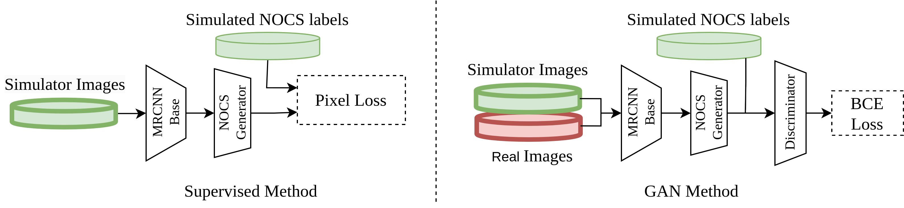
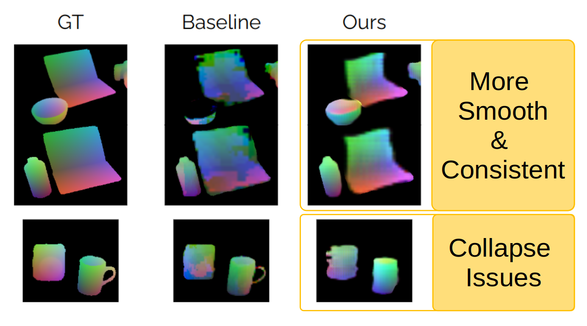

# GANOCS: Domain Adaptation of Normalized Object Coordinate Prediction Using Generative Adversarial Training

You could [find the paper here](https://baldeeb.github.io/assets/pdf/CoRL_2023___Out_of_Distribution_Generalization_in_Robotics.pdf). The work was published in First Workshop on Out-of-Distribution Generalization in Robotics at CoRL, 2023

We proposed using Generative Adversarial Learning [Normalized Object Coordinate System (NOCS)](https://arxiv.org/pdf/1901.02970.pdf).



We show that our method is capable of producing normalize object coordiate maps smoother over unseen data. Further grounding of the discriminator using sparse depth is a primising next step for this work.



## Dataset

We use the dataset forom [the original NOCS work](https://github.com/hughw19/NOCS_CVPR2019). We do run some eperiments using [dataset generated through habitat](https://github.com/baldeeb/habitat_datagen_util) and use [rosbag wrappers](https://github.com/baldeeb/rosbag_data_utils) to run some tests on lab collected data.

## Installation

The folllowing packages are required:

``` #!/bin/bash
conda install -c conda-forge pycocotools
conda install pytorch torchvision torchaudio pytorch-cuda=11.7 -c pytorch -c nvidia
conda install -c fvcore -c iopath -c conda-forge fvcore iopath
conda install pytorch3d -c pytorch3d
conda install -c conda-forge scikit-image

pip install hydra-core
pip install tqdm
pip install wandb
pip install opencv-python
```

## Runnint code

Simply run: `python train.py -cn <config-name>`

This code uses hydra configs. `-cn` stands for confg-name and can be set to `base` or `gan`. Other config options pertaining to different experiments can be found in the `./config` folder.
 